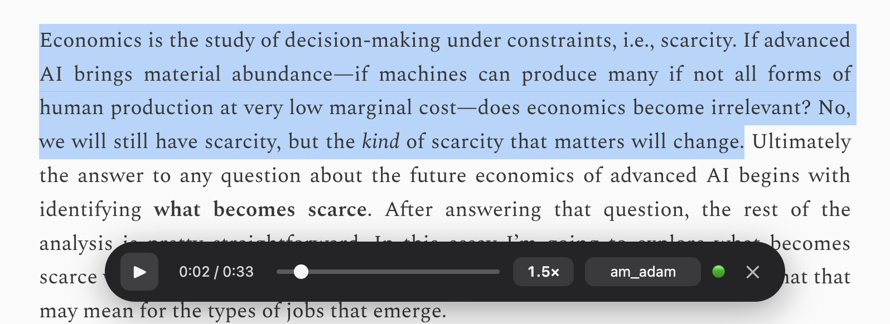

# Audio Reader

> Read selected text — or a whole article — aloud with [Kokoro](https://huggingface.co/hexgrad/Kokoro-82M) TTS, entirely on your machine.

[](LICENSE)
[](extension/manifest.json)
[](#install)

A Chromium browser extension (Chrome / Brave / Edge) that narrates web pages with a
neural TTS voice. Select text and press a shortcut, or read the whole article — a
floating control bar gives you play/pause, a seek scrubber, speed, and voice. Audio
**streams**: playback starts on the first sentence while the rest synthesizes.

**Everything is local. Nothing leaves your machine** — inference runs in your browser
(WebGPU/WASM) or against a local Docker server you control.



## Highlights

- **Read a selection** — select text → `Cmd/Ctrl+Shift+S` (or right-click → *Read selection aloud*).
- **Read the whole article** — `Option/Ctrl+Shift+A` (or right-click → *Read this article*). Extracts the main text (drops nav/ads/comments) with Mozilla Readability; poorly-extracting pages fall back to a manual-selection hint instead of reading garbage.
- **Floating control bar** — play/pause, seek, time, speed (0.75–2×), voice, a live **engine marker** (🟢 WebGPU / 🟡 WASM / 🔵 Server), and close.
- **Streaming playback** — starts on the first sentence; each sentence is MP3-encoded on the fly into one pipeline shared by every engine.
- **Three engines, one boundary** — pick in settings; speed and voice persist between reads.

## Engines

| Engine | Marker | Needs | Notes |
|--------|--------|-------|-------|
| **Browser · WebGPU** | 🟢 | A GPU adapter | Fastest. Downloads the model once (~300 MB), then browser-cached. |
| **Docker server** | 🔵 | A local [Kokoro server](server/README.md) | OpenAI-compatible local server. See [`server/`](server/README.md). |
| **Browser · WASM** | 🟡 | Nothing | Always available, but **below real-time** — great for short selections, buffers on long reads. |

**Automatic** (default) uses the fastest available: WebGPU → Docker server → WASM. A
dead engine is never auto-selected, and an explicitly-chosen engine that's unavailable
surfaces an error rather than silently falling back.

## Install

Distribution is **load-unpacked / open-source** — not an extension-store build.

```bash
git clone https://github.com/HasanResul/audio-reader.git
cd audio-reader/extension
npm install
npm run build      # required only for the in-browser WebGPU/WASM engines
```

Then load it:

1. Open `chrome://extensions` (or `brave://extensions` / `edge://extensions`).
2. Toggle **Developer mode**.
3. **Load unpacked** → select the `extension/` folder.
4. Toolbar icon → **Settings**: pick an **Engine** and a voice/default speed.
5. (Optional) Confirm the shortcuts at `chrome://extensions/shortcuts`.

> The build step bundles the in-browser engine (kokoro-js + onnxruntime-web + an MP3
> encoder) and vendors the ORT wasm — MV3 forbids remote script. If you only ever use
> the Docker server engine you can skip the build; the extension loads without the
> bundle and just won't offer the browser engines.

The optional **Docker server** engine is documented in [`server/README.md`](server/README.md).

## How it works

One extension, one engine boundary: everything except *"produce audio from text"* is
shared across engines. A hidden offscreen document runs WebGPU + audio playback and is
the only context allowed to reach `localhost`; a shared, engine-agnostic player streams
MP3 chunks from whichever engine produced them.

Full architecture, file-by-file breakdown, and known limitations live in
[`extension/README.md`](extension/README.md). The design history, research, and
benchmarks are under [`docs/`](docs/).

## Requirements

- Chromium-based browser (Chrome / Brave / Edge) — the in-browser engine needs WebGPU/WASM as shipped by Chromium.
- Node.js + npm (for the in-browser engine build).
- Docker (optional, only for the Docker server engine).

## Contributing

Issues and PRs welcome — see [CONTRIBUTING.md](CONTRIBUTING.md). For security reports,
see [SECURITY.md](SECURITY.md).

## License

[MIT](LICENSE). This project vendors and bundles third-party components under their own
licenses — see [THIRD-PARTY-NOTICES.md](THIRD-PARTY-NOTICES.md).
